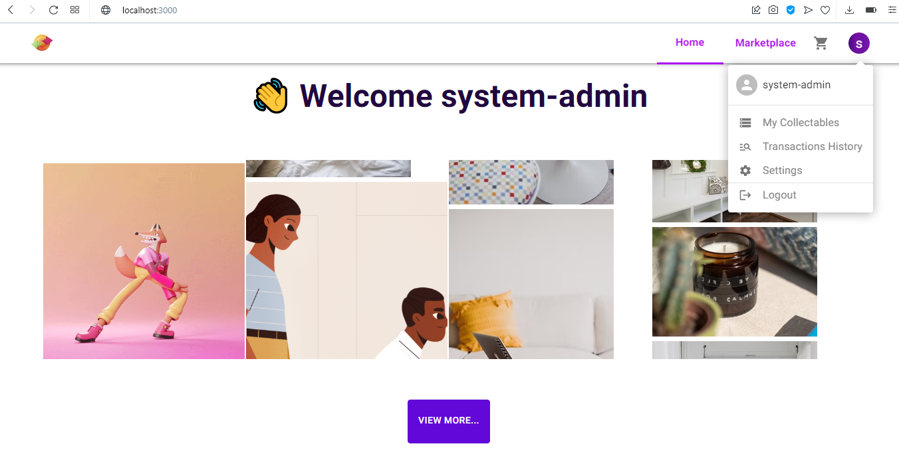

## ❗WARNING
This project is just an educational system, NOT a system made to carry out large transactions
and with the same focus as nft. I developed this system only with the intention of showing that 
I could even create an e-commerce (for example) accepting payments with cryptocurrencies outside the blockchain.

### 💸GdMoney
After finishing the backend api development module of my course, I decided to develop this
project as a course conclusion project, where I gathered my front-end and back-end knowledge
in a different proposal, the use of cryptocurrency payments by off the blockchain



## 📲System Video
<a>https://www.linkedin.com/feed/update/urn:li:activity:6945430878814679041/</a>

## 💡Technologies
- ReactJS
- Firebase
- NextJs
- TypeScript
- VanillaJS
- Material UI
- Sass
- Styled Components

## 🚀 Starting
Run the server
```bash
npm run dev
# or
yarn dev
```
Open in [http://localhost:3000](http://localhost:3000) 

##Functionalities
>Cart<br />
>Authentication<br />
>Means of payment<br />
>Crud and some context use
